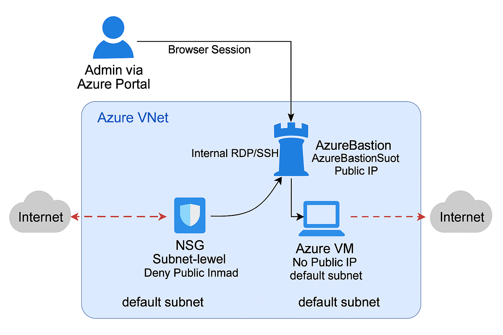

## Azure Secure Virtual Machine with Network Security Group & Bastion Lab

Implementation of a hardened Azure Virtual Machine environment using Network Security Groups (NSG) and Azure Bastion. This lab demonstrates real-world network protection by blocking public RDP/SSH access, enforcing zero-trust segmentation, and enabling secure, browser-based admin access—addressing the #1 cloud security risk: exposed management ports.

---

## Table of Contents

- [Overview](#overview)
- [Real-World Risk](#real-world-risk)
- [What I Built](#what-i-built)
- [Diagram](#diagram)
- [Objectives](#objectives)
- [Steps Performed](#steps-performed)
  - [1. Resource Group and Virtual Network Creation]
  - [2. Subnet and NSG Configuration]
  - [3. Virtual Machine Deployment (No Public IP)]
  - [4. Azure Bastion Subnet Addition]
  - [5. Azure Bastion Deployment]
  - [6. Secure Remote Access Test]
  - [7. Cleanup]
- [Screenshots](#screenshots)
- [Lessons Learned](#lessons-learned)
- [References](#references)
- [Contact](#contact)

---

## Overview

This lab demonstrates how to secure an Azure Virtual Machine at the network layer using a Network Security Group (NSG) and Azure Bastion. The goal is to deploy a VM without any public IP or exposed admin ports, lock down inbound/outbound traffic, and enable secure, browser-based access for administrators.

---

## Real-World Risk

Exposing RDP/SSH to the internet is a leading cause of cloud breaches.
In this lab, I show how to harden Azure VMs so only authorized admins can access them—without ever opening public ports or assigning a public IP.

---

## What I Built

- Deployed an Azure Virtual Machine without a public IP address for maximum security.
- Built a Virtual Network with proper subnets and an associated Network Security Group (NSG) to enforce strict traffic controls.
- Configured NSG rules to block all public RDP/SSH access and allow only trusted internal traffic.
- Created a dedicated Azure Bastion Subnet and deployed Azure Bastion to enable secure, browser-based remote administration of the VM.
- Demonstrated that the VM was only accessible via Bastion, never exposed to the internet.
- Documented each step with clear screenshots and technical explanations.

---

## Diagram

---

## Objectives

- Deploy an Azure Virtual Machine without a public IP address.
- Create and configure a Virtual Network and Network Security Group (NSG) to enforce strict network segmentation.
- Block all inbound public traffic and prevent RDP/SSH exposure to the internet.
- Deploy Azure Bastion and configure a dedicated subnet for secure, browser-based remote access.
- Demonstrate remote admin access via Bastion while maintaining a zero-trust network posture.
- Document each step with screenshots and explain the security value of each configuration.

---

## Steps Performed

**1. Resource Group and Virtual Network Creation**
   - Created a dedicated resource group (SecLab04-RG) for isolation and easy cleanup *(Screenshot: `create-resource-group.png`)*
   - Deployed a virtual network (SecLab04-VM-vnet) with a default subnet for VM and Bastion placement *(Screenshot: `create-vnet.png`)*

**2. Subnet and NSG Configuration**
   - Configured the default subnet for VM placement.
   - Created a Network Security Group (SecLab04-NSG) and associated it with the subnet *(Screenshots: `create-nsg.png` & `associate-nsg.png`)*
   - Ensured NSG rules blocked all inbound public traffic by default *(Screenshot: `nsg-inbound-rules.png`)*

**3. Virtual Machine Deployment (No Public IP)**
   - Deployed a VM (SecLab04-VM) with no public IP assigned.
   - Verified no public inbound ports (RDP/SSH) were open *(Screenshot: `create-vm.png`)*

**4. Azure Bastion Subnet Addition**
   - Added a dedicated subnet (Azure Bastion Subnet) to the VNet for Bastion, using a /26 address space *(Screenshot: `create-bastion-subnet.png`)*

**5. Azure Bastion Deployment**
   - Deployed Azure Bastion (SecLab04-Bastion) into the new subnet.
   - Configured Bastion to use its own public IP for managed, secure connectivity *(Screenshot: `create-bastion.png`)*

**6. Secure Remote Access Test**
   - Connected to the VM securely through Azure Bastion’s browser-based session.
   - Verified RDP/SSH access worked internally, with no public exposure *(Screenshot: `bastion-session.png`)*

**7. Cleanup**
   - Deleted the resource group to remove all lab resources and avoid ongoing costs.

---

## Screenshots

*All screenshots are included in the `screenshots/` folder.*

| Step | Filename                  | Description                                                   |
| ---- | ------------------------- | ------------------------------------------------------------- |
| 1    | create-resource-group.png | Resource group created for the lab.                           |
| 2    | create-vnet.png           | Virtual network and default subnet configuration.             |
| 3    | create-vm.png             | VM deployment (no public IP or open inbound ports)            |
| 4    | create-nsg.png            | Network Security Group creation form filled out.              |
| 5    | nsg-inbound-rules.png     | Final NSG inbound rules (showing “deny all”/no open ports)    |
| 6    | associate-nsg.png         | Associating NSG with VM subnet.                               |
| 7    | create-bastion-subnet.png | Azure Bastion Subnet creation with correct /26 address range. |
| 8    | create-bastion.png        | Bastion creation form, VNet and subnet selected.              |
| 9    | bastion-session.png       | Browser-based RDP/SSH session via Azure Bastion.              |

---

## Lessons Learned

- **Real-World Risk Mitigated:** Eliminated public RDP/SSH exposure, reducing risk of brute-force attacks and unauthorized access—one of the top vectors for cloud breaches.
- **Zero Trust Networking:** Enforced least privilege by denying all inbound traffic except explicitly allowed sources within the virtual network.
- **Azure Bastion Implementation:** Gained hands-on experience setting up Azure Bastion for secure, browser-based VM access without requiring a public IP.
- **Network Segmentation:** Learned to segment networks using subnets and NSGs, a fundamental cloud security skill.

---

## References

- [Secure access to virtual machines with Azure Bastion](https://learn.microsoft.com/en-us/azure/bastion/bastion-overview)
- [Network Security Groups (NSG) documentation](https://learn.microsoft.com/en-us/azure/virtual-network/network-security-groups-overview)
- [Azure Virtual Network documentation](https://learn.microsoft.com/en-us/azure/virtual-network/virtual-networks-overview)
- [Azure VM best practices](https://learn.microsoft.com/en-us/azure/virtual-machines/linux/security-baseline)
- [Quickstart: Create a Windows VM in the Azure portal](https://learn.microsoft.com/en-us/azure/virtual-machines/windows/quick-create-portal)
- [Quickstart: Create a Linux VM in the Azure portal](https://learn.microsoft.com/en-us/azure/virtual-machines/linux/quick-create-portal)

---

## Contact

Sebastian Silva C. – July, 2025 – Berlin, Germany.  
[LinkedIn](https://www.linkedin.com/in/sebastiansilc) | [GitHub](https://github.com/SebaSilC) | [sebastian@playbookvisualarts.com](mailto:sebastian@playbookvisualarts.com)
